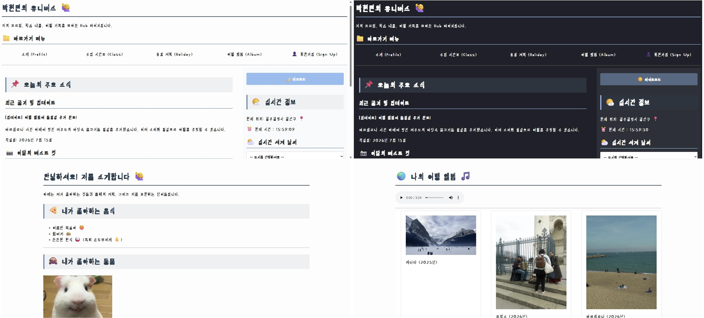

# SKALA 4기 HTML · CSS · JavaScript 과제

HTML, CSS, JavaScript를 활용하여 제작한 개인 웹사이트입니다.

## 📌 소개

메인 페이지를 중심으로 자기소개, 시간표, 휴일 계획, 여행 앨범, 회원가입 페이지를 이동할 수 있도록 구현했습니다.

또한 JavaScript를 활용하여 다양한 기능을 추가했습니다.

## 🛠️ 기술 스택

- HTML
- CSS
- JavaScript

## ✨ 주요 기능

- 다크모드
- 실시간 시계
- Open-Meteo API를 활용한 실시간 날씨
- 업다운 게임
- 성적 계산기
- 내 가방 보기
- 반응형 웹(Flexbox, Grid)

## 📂 프로젝트 구조

```
html/
css/
script/
media/
README.md
```

## 🚀 실행 방법

1. 프로젝트를 다운로드 또는 Clone
2. `index.html`을 실행하거나 Live Server로 실행

## 📷 실행 화면 예시

---

**SKALA 4기 HTML · CSS · JavaScript 실습 과제**